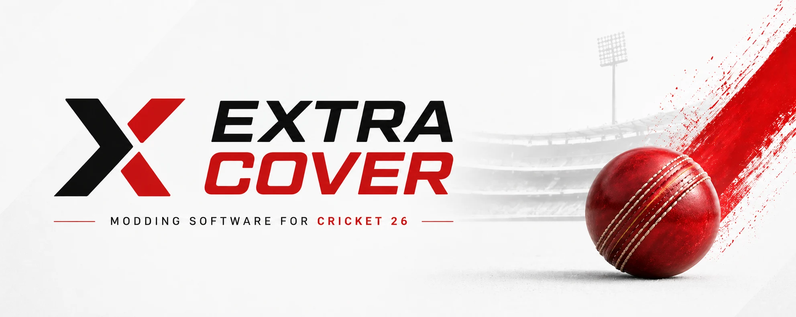

<picture>
  <source media="(prefers-color-scheme: dark)" srcset="assets/banner-dark.webp">
  
</picture>

# Extra Cover — downloads

One-click mods for **Cricket 26** on Steam (PC). Pick a pack, click **Install**,
play. Click **Disable** and the game is exactly as it was.

[](../../releases/latest)
[](../../releases)
[](../../releases/tag/packstudio-beta)
[](../../releases)
[](#what-you-need)
[](#what-you-need)

## Download

| | What it is | Get it |
|---|---|---|
| **Extra Cover** | The app players use to install and remove mods. | **[Latest version →](../../releases/latest)** — the `.exe` installer |
| **Extra Cover beta** | The next version, early. Less tested. | [All releases →](../../releases) — marked *Pre-release* |
| **Pack Studio** (beta) | For people who *make* packs: repaint the game's textures, replace sounds, build a pack. | **[packstudio-win-x64.zip](../../releases/download/packstudio-beta/packstudio-win-x64.zip)** |

Packs themselves are installed from inside Extra Cover — see [Getting mods](#getting-mods).

## What you need

- **Windows 10 or 11**, 64-bit.
- **Cricket 26** installed through **Steam**.

Nothing else. Both apps bring everything they need with them.

## Install Extra Cover

1. Download `extra-cover-Setup-<version>.exe` from the
   [latest release](../../releases/latest) and run it.
2. **Windows may warn you.** The builds are not code-signed, so SmartScreen says it
   doesn't recognise the app. Choose **More info**, then **Run anyway**.
3. On first start, Extra Cover finds Cricket 26 through Steam and reads your game
   once to build an index. That takes a few minutes, and only happens again after
   the game updates.

**Updates are automatic.** Extra Cover checks for a new version and asks before
installing it. To try test builds early, turn on **Settings → Beta updates**.

## Getting mods

- **Browse community** in Extra Cover lists packs other players have made. They
  are hosted on [GameBanana](https://gamebanana.com/games/25674), in the
  [Extra Cover Mods](https://gamebanana.com/mods/cats/49896) category, and install
  with one click.
- **Got a `.c26pack` file?** Double-click it, or use **Import a pack…** in Extra Cover.
- **Several packs at once** is fine, as long as they don't change the same thing.
  Extra Cover tells you if two packs overlap.

## Removing mods, and keeping your game safe

- Extra Cover **backs up every game file before changing it**. **Disable** puts a
  pack's files back exactly; **Settings → Disable all mods** restores the whole game.
- **Close Cricket 26** before installing or disabling. Extra Cover will remind you.
- **After a Cricket 26 update**, Extra Cover notices and refreshes its index. A pack
  made for the old version may say it *needs an update*; its creator publishes one.
- **Last resort:** Steam → Cricket 26 → **Properties → Installed Files → Verify
  integrity of game files** removes every mod and restores the original game.
  Extra Cover can start this for you from **Settings → Troubleshooting**.

## Make your own packs with Pack Studio

1. Download **[packstudio-win-x64.zip](../../releases/download/packstudio-beta/packstudio-win-x64.zip)**,
   extract the whole ZIP, and run `packstudio.exe`. Nothing to install; keep the
   `deps` folder next to the exe.
2. It finds your game and opens in your browser. Browse or search the game's
   textures and sounds, and add the ones you want to a pack.
3. Export the pictures as PNGs, repaint them in any editor (Photoshop, GIMP,
   Paint.NET, Krita, Photopea…) and save them in place — same name, same size.
   Replace sounds with a WAV, MP3, OGG or FLAC.
4. **Build** the pack, **Test in game** (it hands the pack to Extra Cover), then
   **Publish** — Pack Studio walks you through uploading it to GameBanana.

Pack Studio checks for its own updates and tells you when one is ready.

## Check a download (optional)

Pack Studio's ZIP has a `.sha256` file beside it. In PowerShell:

```powershell
(Get-FileHash .\packstudio-win-x64.zip -Algorithm SHA256).Hash
```

The result should match the first word of `packstudio-win-x64.zip.sha256`.

## Problems?

| Symptom | Fix |
|---|---|
| "Windows protected your PC" | **More info → Run anyway** (the builds are unsigned). |
| "Cricket 26 is running" | Close the game, then try again. |
| A pack says it *needs an update* | The game was updated. Wait for the pack's creator to publish a new version, or disable the pack. |
| The game sticks on its loading screen after installing a pack | Open Extra Cover and **Disable** that pack. If you can't, verify the game files in Steam (above). |
| Extra Cover can't find the game | When it asks, choose your Cricket 26 folder — the one that contains `data`. |

Still stuck? [Open an issue](../../issues) and say what you clicked and what happened.

## About these downloads

Each release also carries the source code of the mod engine that runs inside both
apps (the `…engine-source….zip` file), which is licensed under GPL-3.0-or-later.
The apps themselves are not open source; see the `LICENSE` and `NOTICE` files in
each download. The **Source code (zip / tar.gz)** links GitHub adds to every
release contain only this page.

Extra Cover is an **unofficial fan project**. It is not affiliated with, endorsed
by, or connected to Big Ant Studios, Cricket 26, the BCCI, the Indian Premier
League, or any team, league or sponsor. **No game content is distributed with this
software**: it changes files already installed on your PC and keeps a backup of
every one it touches. Product names and trademarks are used only to say what this
software works with, and remain the property of their respective owners.

<sub>Downloads:
[](../../releases/latest)
[](../../releases/tag/packstudio-beta)
[](../../releases)</sub>
